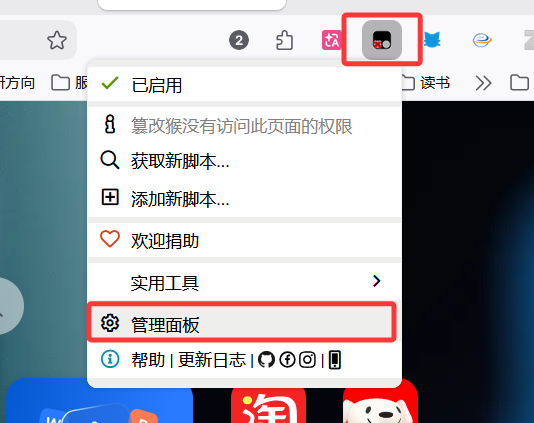
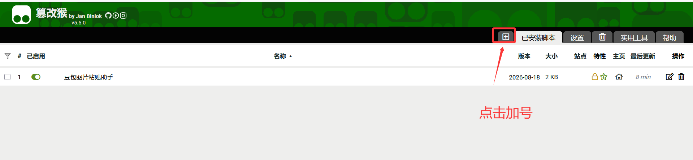
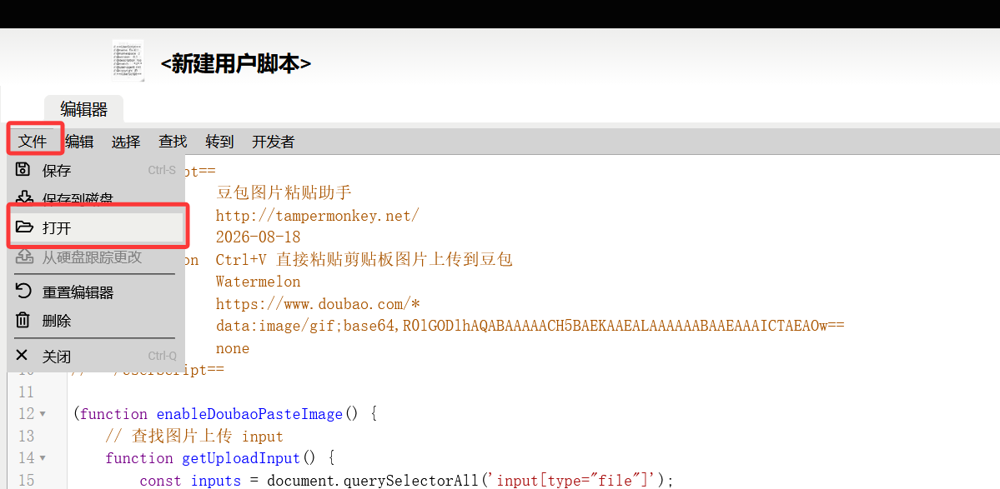

# 豆包图片粘贴助手

在豆包网页版支持 `Ctrl+V` 直接粘贴图片上传。

## 功能说明

豆包网页版默认只支持文字复制粘贴，图片复制粘贴没有反应。安装此插件后，可以直接在聊天框中使用 `Ctrl+V` 粘贴图片，图片会自动上传。

## 安装方法

### 方法一：直接加载扩展程序（推荐）

1. 打开 Edge 浏览器，访问 `edge://extensions/`
2. 开启右上角的「开发者模式」
3. 点击「加载已解压的扩展程序」
4. 选择 `doubao-paste-image` 文件夹

### 方法二：安装 .crx 文件

1. 打开 Edge 浏览器，访问 `edge://extensions/`
2. 开启右上角的「开发者模式」
3. 将 `doubao-paste-image.crx` 文件拖拽到扩展页面
4. 点击「添加扩展程序」

### 方法三：Firefox 浏览器

1. 打开 Firefox 浏览器，地址栏输入 `about:debugging#/runtime/this-firefox`

2. 点击「临时载入附加组件...」

   

3. 选择 `doubao-paste-image` 文件夹中的 `manifest.json` 文件


1. 插件加载成功后即可使用

> 注意：Firefox 临时加载的插件在浏览器关闭后会自动移除，下次需要重新加载。

### 方法四：Tampermonkey 油猴脚本（推荐 Firefox 用户使用）

此方法适用于 Firefox、Chrome、Edge 等浏览器，通过 Tampermonkey 插件加载脚本，可永久使用。

**第一步：安装 Tampermonkey 插件**

1. 在浏览器扩展商店搜索并安装 [Tampermonkey](https://www.tampermonkey.net/)
2. 也可参考视频教程：[B站安装教程](https://www.bilibili.com/video/BV1xmLvzwEJi/)

**第二步：导入脚本**

1. 点击浏览器工具栏的 Tampermonkey 图标，选择「管理面板」

   

2. 点击顶部「+」号，新建脚本

   

3. 在编辑器中点击「文件」→「打开」，选择 `豆包图片粘贴助手-2026-08-18.user.js` 文件导入

   

   点击「保存」即可，脚本会自动生效

## 使用方法

1. 访问 [豆包](https://www.doubao.com)
2. **登录后进入聊天页面**（必须登录）
3. 复制任意图片（我用QQ截图比较多）
4. 在输入框中按 `Ctrl+V` 粘贴图片
5. 图片会自动上传，可发送

## 文件结构

```
doubao-paste-image/
├── manifest.json              # 插件配置文件
├── content.js                 # 功能脚本
├── doubao-paste-image.user.js # Tampermonkey 油猴脚本
── README.md                  # 说明文档
├── doubao-paste-image.crx     # 可直接安装的插件包
└── doubao-paste-image.pem     # 私钥文件（用于重新打包）
```

## 注意事项

- 仅支持豆包网页版 (doubao.com)
- 需要开启开发者模式才能安装
- 插件仅注入到豆包网站，不影响其他页面
