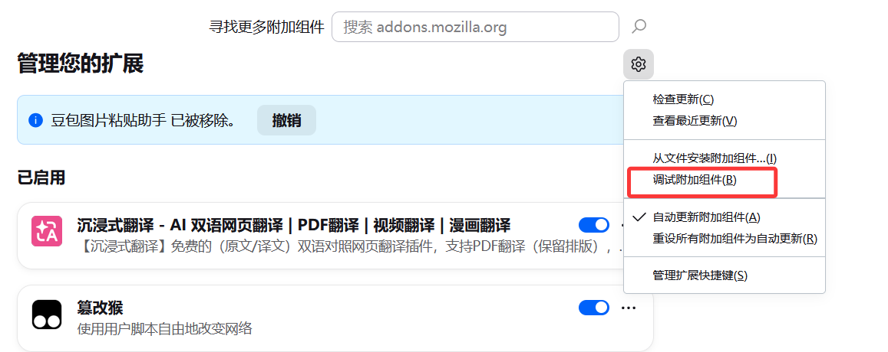
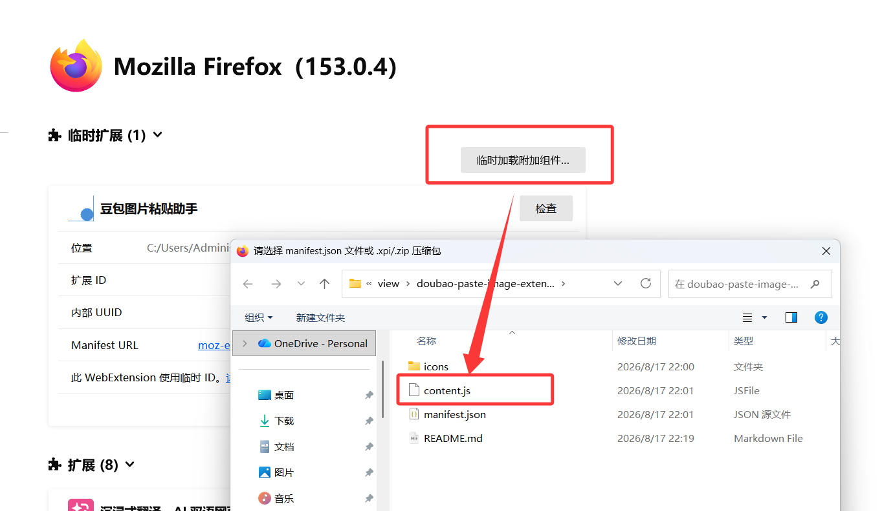

# Doubao Image Paste Helper

Enable `Ctrl+V` to paste images directly into Doubao web chat.

## Features

Doubao web version only supports text copy-paste by default — pasting images does nothing. After installing this extension, you can paste images directly into the chat box using `Ctrl+V`, and the image will be uploaded automatically.

## Installation

### Method 1: Load Unpacked Extension (Recommended for Chrome/Edge)

1. Open Edge browser and go to `edge://extensions/`
2. Enable **Developer mode** in the top-right corner
3. Click **Load unpacked**
4. Select the `doubao-paste-image` folder

### Method 2: Install .crx File

1. Open Edge browser and go to `edge://extensions/`
2. Enable **Developer mode** in the top-right corner
3. Drag the `doubao-paste-image.crx` file onto the extensions page
4. Click **Add extension**

### Method 3: Firefox Browser (Temporary)

1. Open Firefox and go to `about:debugging#/runtime/this-firefox`
2. Click **Load Temporary Add-on...**

   

3. Select the `manifest.json` file inside the `doubao-paste-image` folder

   

4. The extension is now active

> Note: Temporarily loaded add-ons are removed when Firefox closes. You need to reload it each time.

### Method 4: Tampermonkey Userscript (Recommended for Firefox, Permanent)

This method works on Firefox, Chrome, Edge, and other browsers. It uses the Tampermonkey extension to load the script permanently.

**Step 1: Install Tampermonkey**

1. Search and install [Tampermonkey](https://www.tampermonkey.net/) from your browser's extension store
2. Or follow this video tutorial: [Bilibili Tutorial](https://www.bilibili.com/video/BV1xmLvzwEJi/)

**Step 2: Import the Script**

1. Click the Tampermonkey icon in your browser toolbar, then select **Dashboard**

   

2. Click the **+** button to create a new script

   

3. In the editor, click **File** → **Open**, then select the `doubao-paste-image.user.js` file

   

4. Click **Save** — the script will take effect immediately

## Usage

1. Go to [Doubao](https://www.doubao.com)
2. **Log in and enter a chat page** (login required)
3. Copy any image (e.g., via QQ screenshot)
4. Press `Ctrl+V` in the input box to paste the image
5. The image will be uploaded automatically and ready to send

## File Structure

```
doubao-paste-image/
├── manifest.json              # Extension manifest
├── content.js                 # Core script
├── doubao-paste-image.user.js # Tampermonkey userscript
├── README.md                  # Documentation (Chinese)
├── README_en.md               # Documentation (English)
├── doubao-paste-image.crx     # Pre-built extension package
── doubao-paste-image.pem     # Private key (for repacking)
```

## Notes

- Only works on Doubao web version (doubao.com)
- Developer mode must be enabled for extension installation
- The extension only injects into Doubao pages and does not affect other websites
